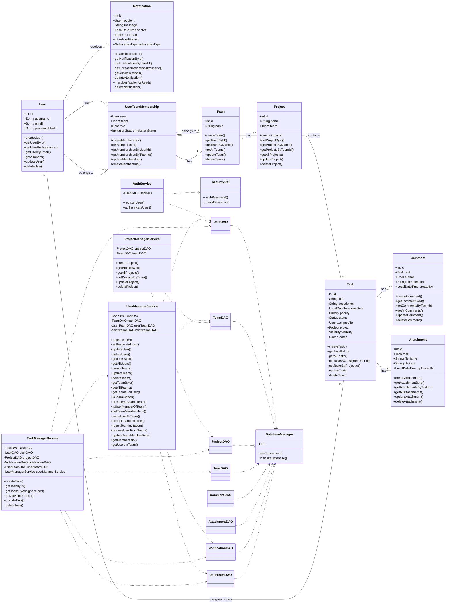
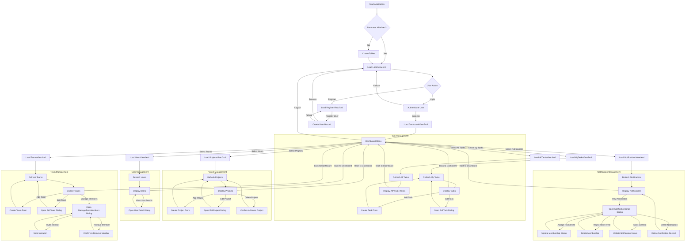

# TaskForge

TaskForge is a desktop task management application built with JavaFX and SQLite. It allows users to manage personal tasks, collaborate within teams on projects, and receive notifications for important events like team invitations and task assignments.

## Table of Contents
1. [Class Diagram](#class-diagram)
2. [Flowchart](#flowchart)
3. [User Manual](#user-manual)
   - [1. Getting Started](#1-getting-started)
   - [2. Login and Registration](#2-login-and-registration)
   - [3. Dashboard Overview](#3-dashboard-overview)
   - [4. Managing My Tasks](#4-managing-my-tasks)
   - [5. Viewing All Tasks](#5-viewing-all-tasks)
   - [6. Project Management](#6-project-management)
   - [7. Team Management](#7-team-management)
   - [8. User Management](#8-user-management)
   - [9. Notifications](#9-notifications)
   - [10. Logout](#10-logout)
4. [Requirements](#requirements)
   - [Functional Requirements](#functional-requirements)
   - [Non-Functional Requirements](#non-functional-requirements)

## Class Diagram
The following diagram illustrates the core classes and their relationships within the TaskForge application.



## Flowchart
Main Application Flow



## User Manual
This manual will guide you through the TaskForge application.

### 1. Getting Started
To run TaskForge, you need:
- Java Development Kit (JDK) 21 or later
- Apache Maven (for building and running)

**Steps to Run:**
1. Delete the existing database (if any):
   ```bash
   del taskforge.db
   ```
   (On Linux/macOS: `rm taskforge.db`)
2. Build the project and install dependencies:
   ```bash
   mvn clean install
   ```
3. Run the application:
   ```bash
   mvn javafx:run
   ```

### 2. Login and Registration
**Registration:**
1. On the initial screen, click "Go to Register"
2. Fill in your desired Username, Email, and Password
3. Confirm your password
4. Click "Register". If successful, you will see a confirmation message
5. Click "Back to Login" to return to the login screen

**Login:**
1. Enter your registered Username and Password
2. Click "Login". If successful, you will be directed to the Dashboard

### 3. Dashboard Overview
The Dashboard is the main hub of the application:
- Left navigation menu with sections: "My Tasks", "All Tasks", "Projects", "Teams", "Users", and "Notifications"
- Your logged-in username is displayed at the top right
- Click "Logout" to return to the Login screen

### 4. Managing My Tasks
This section displays tasks specifically assigned to you.

**Create New Task:**
1. Fill in the "Title", "Description" (optional), "Due Date" (optional), "Priority", and "Visibility" fields
2. Click "Add Task". The task will be assigned to you as the creator

**Refresh Tasks:** Click "Refresh Tasks" to update the list

**Edit Task:**
1. Select a task from the table
2. Click the "Edit" button
3. Modify task details in the dialog
4. Click "Save Changes" or "Cancel"

**Delete Task:**
1. Select a task from the table
2. Click the "Delete" button
3. The task will be permanently removed (Only the creator can delete)

### 5. Viewing All Tasks
This section displays all tasks in the system that are visible to you based on their visibility settings (Public, Restricted, Private).

**Refresh All Tasks:** Click "Refresh All Tasks" to update the list

### 6. Project Management
This section allows you to create and manage projects.

**Create New Project:**
1. Enter a "Project Name"
2. Optionally select a "Team"
3. Click "Add Project"

**Refresh Projects:** Click "Refresh Projects" to update the list

**Edit Project:**
1. Select a project from the table
2. Click the "Edit" button
3. Modify details in the dialog
4. Click "Save Changes" or "Cancel"

**Delete Project:**
1. Select a project from the table
2. Click the "Delete" button
3. The project will be removed

### 7. Team Management
This section allows you to create and manage teams, and invite users.

**Create New Team:**
1. Enter a "Team Name"
2. Click "Add Team". Creator becomes owner

**Refresh Teams:** Click "Refresh Teams" to update the list

**Edit Team:**
1. Select a team from the table
2. Click the "Edit" button
3. Change the team's name
4. Click "Save Changes" or "Cancel"

**Delete Team:**
1. Select a team from the table
2. Click the "Delete" button
3. The team will be removed

**Manage Members:**
1. Select a team
2. Click "Manage Members"
3. In the dialog:
    - Invite Member: Select user and role, click "Invite Member"
    - Remove Selected Member: Select member, click remove
4. Click "Close" when done

### 8. User Management
This section allows you to view all registered users.

**Refresh Users:** Click "Refresh Users" to update the list

### 9. Notifications
This section displays all notifications sent to your account.

**Refresh Notifications:** Click "Refresh Notifications" to update

**Notification Actions:**
- Team Invitation: Click "Accept" or "Reject"
- Mark as Read: Click "Mark as Read"
- Delete: Click "Delete" to remove

### 10. Logout
Click the "Logout" button in the top right corner to return to the Login screen.

## Requirements

### Functional Requirements

**User Management:**
- FR1.1: Users shall be able to register with a unique username and email
- FR1.2: Users shall be able to log in with their registered credentials
- FR1.3: Users shall be able to view a list of all registered users
- FR1.4: Users shall be able to update their own profile information
- FR1.5: Users shall be able to change their password
- FR1.6: Users shall be able to delete their own account

**Task Management:**
- FR2.1: Users shall be able to create new tasks with title, description, due date, priority, and visibility
- FR2.2: Tasks shall have status (Pending, In Progress, Completed, Blocked)
- FR2.3: Tasks can be assigned to specific users
- FR2.4: Tasks can be associated with projects
- FR2.5: Users shall be able to view tasks assigned to them ("My Tasks")
- FR2.6: Users shall be able to view all visible tasks ("All Tasks")
    - FR2.6.1: Public tasks visible to all
    - FR2.6.2: Restricted tasks visible to creator and team members
    - FR2.6.3: Private tasks visible only to creator

[Rest of the functional requirements...]

### Non-Functional Requirements

**Performance:**
- NFR1.1: The application should respond within 1-2 seconds
- NFR1.2: Database operations should be efficient for up to 1000 records

**Usability:**
- NFR2.1: UI should be intuitive and easy to navigate
- NFR2.2: Clear feedback messages for user actions
- NFR2.3: Consistent visual design

**Reliability:**
- NFR3.1: Handle common errors gracefully
- NFR3.2: Ensure reliable data persistence

**Security:**
- NFR4.1: Store passwords securely using BCrypt
- NFR4.2: Prevent unauthorized access
- NFR4.3: Role-based access control

**Maintainability:**
- NFR5.1: Well-structured, modular code following MVC
- NFR5.2: Well-commented code with Javadoc
- NFR5.3: Maven dependency management

**Scalability (Basic):**
- NFR6.1: SQLite sufficient for single-user/small-team
- NFR6.2: Architecture allows for future database migration